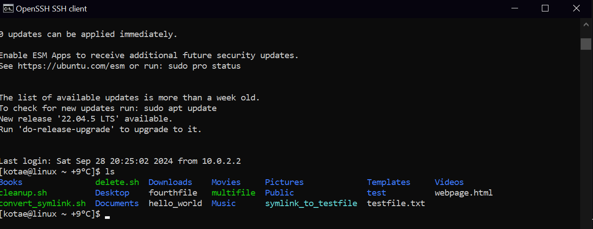
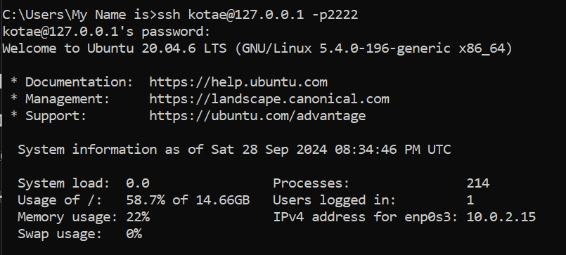
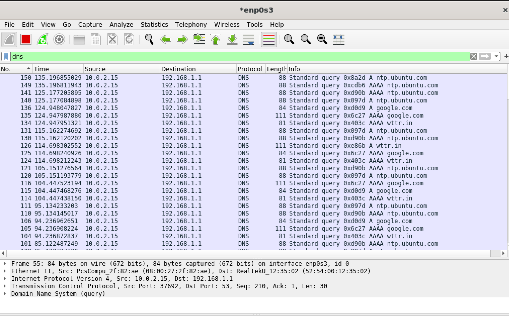

# 18.6 Практическая работа


## Задание 1

```bash
sudo apt-get update
sudo apt-get install openssh-server

# Настройка SSH-сервера
sudo vim /etc/ssh/sshd_config

# Отключаем небезопасные методы аутентификации
ChallengeResponseAuthentication no
PasswordAuthentication no
UsePAM no
PermitRootLogin no
```



#### Как будет выглядеть сгенерённый fingerprint вашей виртуальной машины?

- Эта строка будет включать информацию о типе ключа и его хэш в формате SHA256.
---

## Задание 2

```bash
# Настройка SSH-сервера на работу по порту 2222
sudo vim /etc/ssh/sshd_config

# Изменение порта
Port 2222

# Перезапуск сервиса
sudo systemctl restart sshd
```



## Задание 3

```bash
# Установка Wireshark
sudo apt-get update
sudo apt-get install wireshark

# Запуск Wireshark
sudo wireshark &

# Выполнение DNS-запроса
curl google.com
```



#### На каком уровне в стеке протоколов TCP/IP располагается DNS?

DNS располагается на уровне приложений.

#### Какой протокол транспортного уровня используется для DNS? Как вы думаете, почему?

DNS обычно использует UDP для запросов, поскольку он обеспечивает быструю передачу данных без необходимости устанавливать соединение, что делает его эффективным для малых по размеру запросов и ответов.

Также может использоваться TCP в случаях, когда требуется надёжная передача данных или размер ответа превышает допустимый для UDP.