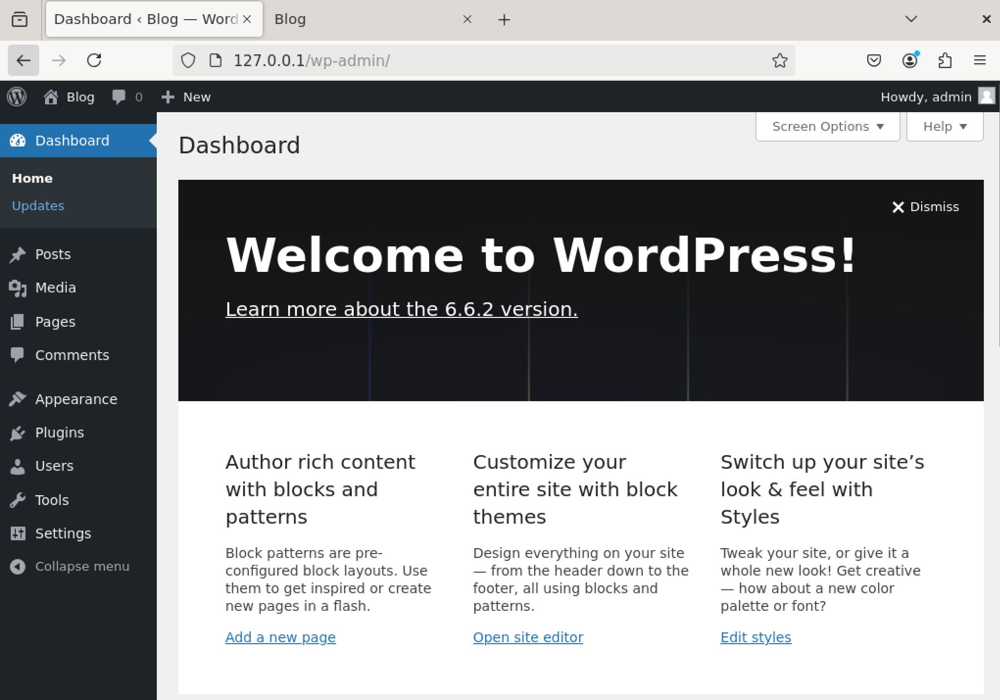
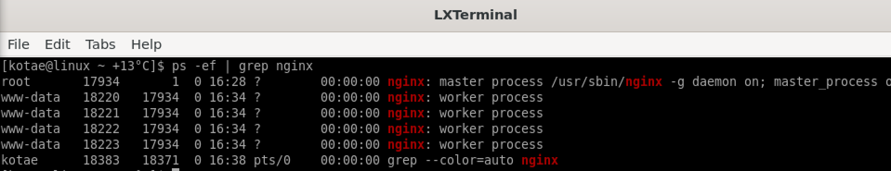
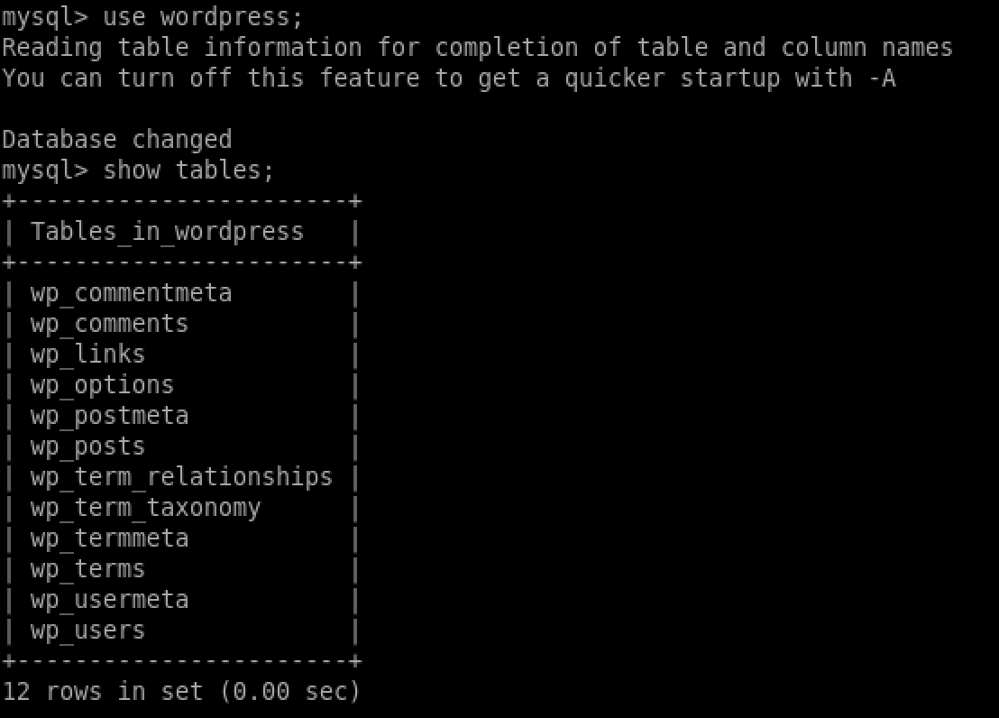

# 19.6 Практическая работа
## Задание 1: Установка и настройка LEMP-стека

```bash
# Установка MySQL
sudo apt-get update
sudo apt-get install mysql-server

# Настройка базы данных
sudo mysql -u root -p

CREATE DATABASE wordpress DEFAULT CHARACTER SET utf8 COLLATE utf8_unicode_ci;
CREATE USER 'wordpressuser'@'localhost' IDENTIFIED with mysql_native_password BY 'admin';
GRANT ALL ON wordpress.* TO 'wordpressuser'@'localhost';
FLUSH PRIVILEGES;
EXIT;

# Установка PHP и необходимых модулей
sudo apt update
sudo apt install php-fpm php-curl php-gd php-intl php-mbstring php-soap php-xml php-xmlrpc php-zip php-mysql
sudo systemctl restart php7.4-fpm

# Настройка Nginx
cd /etc/nginx/sites-available/
sudo vim /etc/nginx/sites-available/wordpress

# Конфигурация Nginx для WordPress
server {
    location = /favicon.ico { log_not_found off; access_log off; }
    location = /robots.txt { log_not_found off; access_log off; allow all; }
    location ~* \.(css|gif|ico|jpeg|jpg|js|png)$ {
        expires max;
        log_not_found off;
    }
    location / {
        try_files $uri $uri/ /index.php$is_args$args;
    }
}

# Проверка и перезагрузка Nginx
sudo nginx -t
sudo systemctl reload nginx

# Установка WordPress
cd /tmp
curl -LO https://wordpress.org/latest.tar.gz
tar xzvf latest.tar.gz
sudo mkdir /var/www/wordpress
sudo cp -a /tmp/wordpress/. /var/www/wordpress
sudo chown -R www-data:www-data /var/www/wordpress

# Настройка WordPress
cd /var/www/wordpress/
sudo cp wp-config-sample.php wp-config.php
sudo chown www-data:www-data wp-config.php

# Генерация ключей безопасности
curl -s https://api.wordpress.org/secret-key/1.1/salt/

# Настройка конфигурации WordPress
sudo vim /var/www/wordpress/wp-config.php

# Настройка подключения к базе данных
define('DB_NAME', 'wordpress');
define('DB_USER', 'wordpressuser');
define('DB_PASSWORD', 'admin');
define('FS_METHOD', 'direct');
```




---
## Задание 2: Межпроцессное взаимодействие в LEMP-стеке

Для связи WordPress и Nginx в LEMP-стеке используется FastCGI. Это связано с тем, что Nginx передаёт запросы PHP-скриптов через протокол FastCGI к процессу PHP-FPM, который обрабатывает выполнение PHP-кода.

---
## Задание 3: Работа с процессами

```bash
# Определение PPID процессов
ps -ef | grep nginx
```




- PPID для **nginx worker** process: 17934
- PPID для **nginx master** process: 1

---
## Задание 4: Работа с базой данных WordPress

